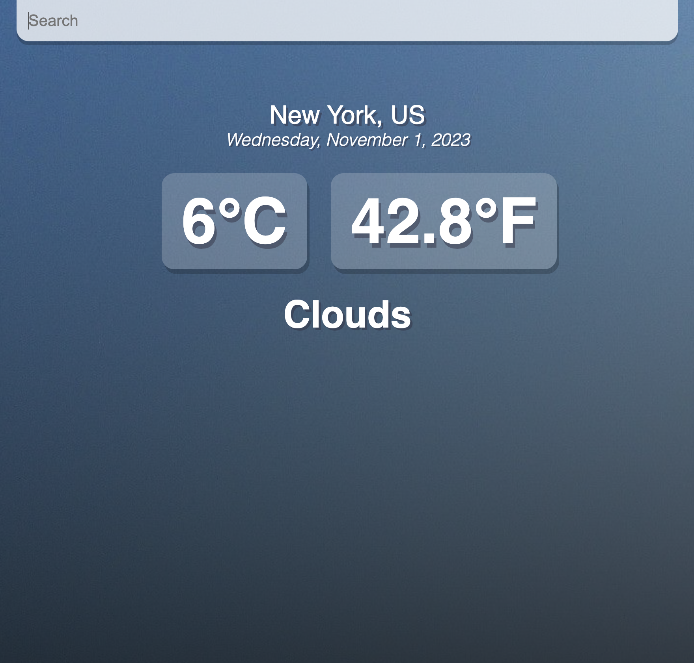

# About
This is a weather-temperature converter project that the user can search for a city and the current weather of BOTH Celsius and Fahrenheit will appear along with the date and time. Nothing will be shown when user inputs a incorrect city name. 

# Preview
This is a preview image of the app when the user asks for current whether in New York. 



# Built With
- React
- JavaScript
- CSS 

# Installation 
1. Get a free API Key at https://openweathermap.org/api
2. Clone the repo
   ```sh
   git clone https://github.com/hyunjunghwang/weather-converter-app.git
   ```
3. Install NPM packages
   ```sh
   npm install
   ```
4. Enter your API in `config.js`
   ```js
   const API_KEY = 'ENTER YOUR API';
   ```